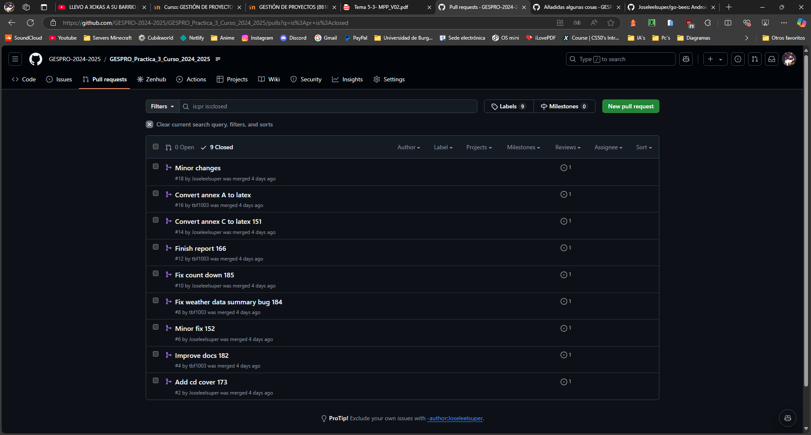

# GESPRO PRACTICA 3 2024-2025
## Índice
1. [Introducción](#introducción)
2. [Guía de secuencia de acciones](#guía-de-secuencia-de-acciones)
3. [Gráfico con la lista de commits](#gráfico-con-la-lista-de-commits)
4. [Imagen Primer commit](#imagen-primer-commit)
5. [Imagen Último commit](#imagen-último-commit)
6. [Resolver conflicto de Commits](#resolver-conflicto-de-commits)
7. [Capturas de Pull Request](#capturas-de-pull-request)
8. [Miembros del grupo](#miembros-del-grupo)

## Introducción
En esta práctica hemos tenido que crear 2 forks para poder trabajar con las versiones de un proyecto como si las estuviésemos haciendo nosotros. Hemos hecho commits de forma alternada entre los miembros del grupo y hemos hecho pull requests para poder fusionar los cambios en el proyecto forkeado por nosotros de Miguel en la rama master.

## Guía de secuencia de acciones
1.  Con GitHub, crear un fork del proyecto original vinculado a un repositorio de nuestra cuenta con el nombre de Go Bees.

2.  Con GitHub, crear una organización con los miembros del grupo.

3. Desde GitHub, crear un fork del proyecto de Miguel vinculado a la organización con el nombre de Práctica 3.

4. Clonar ambos forks en local usando GritKraken.

5. En nuestro proyecto Go Bees, buscar en GitKraken un commit antiguo para hacer un hard reset y volver a ese commit.

6. Ir a nuestro proyecto Práctica 3 en GitHub y crear un issue. Después, desde la issue crear una rama a partir de ese issue. Además, en GitKraken, comprobar que la rama de master esté en la última actualización del proyecto práctica 3.

7. Hacer un copy-paste en local del proyecto go bees al proyecto práctica 3 desde el explorador de archivos.

> [!IMPORTANT]
> No añadir el fichero .git, ya que fastidiará el proyecto y se tendrá que volver a empezar desde el commit que se estaba haciendo.

8. Hacer un commit y push en el proyecto práctica 3 desde GitKraken.

9. Crear una pull request en el proyecto práctica 3 para fusionar los cambios de la rama temporal la rama master.
10. Aceptar la pull request y actualizar local.

11. Repetir hasta que se hayan hecho todos los commits a la fecha 08/02/2017 ✅.

## Gráfico con la lista de commits
En la siguiente imagen a la izquierda se pueden ver en la sección de local las ramas editadas en local desde el ordenador actual. Debajo en Remote se pueden ver todas las ramas que se han creado, incluidas las que se han generado y editado desde otros ordenadores.
El listado de la izquierda es la gráfica con los commits con los cambios y los merges hechos por ambos integrantes del equipo, se puede identificar cada uno con su icono de github.

Además, en las siguiente imagenes se pueden ver todas las Issues  de las que se crearon ramas y las pull request para actualizar dichas ramas que se crearon desde Github y se cerraron automáticamente a posteriori al actualizar desde GitKraken.

## Imagen Primer commit
En la siguiente imagen se puede ver el primer commit creado y mergeado correspondiente al primer commit del 01/02/2017 de nuestro fork del repositorio Go Bees.

## Imagen Último commit
En la siguiente imagen se puede ver el último commit creado y mergeado correspondiente al último commit del 08/02/2017 de nuestro fork del repositorio Go Bees.

## Resolver conflicto de Commits
1. Hacer un push al repositorio.

2. Comprobar que nos sale mensaje de error, debido a que no hemos hecho pull de los últimos cambios en remoto.

3. Sincronizar los cambios de remoto con los locales y después volver a hacer push.

Entonces se creará un commit que corresponde a la fusión de los cambios de remoto con los locales.

## Capturas de Pull Request

## Miembros del grupo
<table>
    <tr>
        <td align="center"><a href="https://github.com/Joseleelsuper"> <b>José Gallardo Caballero</b></a></td>
        <td align="center"><a href="https://github.com/tbf1003"> <b>Tatiana Bejenaru Forostenco</b></a></td>
        <td align="center"><a href="https://github.com/marwan-03-ux"> <b>Marwan Al Hadaddin</b></a></td>
    </tr>
</table>

Volver al [índice](#índice).
